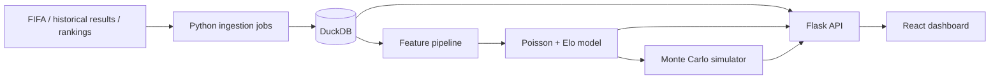

# World Cup Forecast 2026 Roadmap

Complexity: 12 -> HIGH mode

## Context

Problem: Build a forecasting tool that predicts FIFA World Cup 2026 match outcomes and tournament paths using current tournament data plus historical international results.

Files analyzed:

- `/home/joao/.claude/skills/prd-creator/SKILL.md`
- Current web sources listed in `data/source_manifest.md`

Current tournament assumptions as of June 20, 2026:

- The 2026 World Cup started on June 11, 2026 and runs through July 19, 2026.
- The format is 48 teams and 104 matches.
- The group stage is underway, with official fixtures/results and standings published by FIFA.
- News and schedule sources on June 20 list matchday activity including USA vs Australia, Scotland vs Morocco, Brazil vs Haiti, Turkiye vs Paraguay, Netherlands vs Sweden, Germany vs Ivory Coast, Ecuador vs Curacao, and Tunisia vs Japan.
- Results observed in current sources include USA 4-1 Paraguay, Australia 2-0 Turkiye, Brazil 3-0 Haiti, Turkiye 0-1 Paraguay, and other early group-stage results. These must be refreshed from source connectors before any public prediction is trusted.

## Solution

Approach:

- Use Python for ingestion, feature engineering, model training, calibration, and simulation.
- Use Flask as a narrow API over forecasts, data freshness, teams, matches, groups, and simulations.
- Use React/Vite for a dashboard that shows match odds, expected goals, group tables, and simulation distributions.
- Store local reproducible datasets in DuckDB with raw source snapshots in `data/raw`.
- Start with transparent statistical baselines before adding complex ML models.

Architecture:

Key decisions:

- Backend language: Python because the core product is forecasting and data science.
- API framework: Flask for speed, low ceremony, and easy local deployment.
- Frontend: React + TypeScript + Vite because the UI needs interactive tables/charts without locking into a larger full-stack framework.
- Database: DuckDB for analytical local workflows; SQLite can be added later only if mutation-heavy app state appears.
- First model: interpretable Elo/SPI-style ratings plus independent/team-strength Poisson goal rates, calibrated on historical international matches and updated with 2026 tournament results.

## Integration Points

How will this feature be reached?

- Entry point: `frontend/src/App.tsx` loads dashboard routes.
- Caller file: `frontend/src/api/client.ts` calls Flask endpoints.
- API entry point: `backend/src/wc_forecast/api/app.py` registers `/health`, `/api/matches`, `/api/forecasts`, `/api/simulations`.
- Data entry point: `backend/src/wc_forecast/data/ingest.py` will materialize source snapshots into DuckDB.
- Model entry point: `backend/src/wc_forecast/models/forecast.py` will expose match forecast functions used by API services.

Is this user-facing?

- Yes. UI components required: forecast table, match detail panel, group standings table, tournament odds chart, source freshness banner, model input inspection panel.

Full user flow:

1. User opens the React dashboard.
2. Dashboard calls `/api/summary`, `/api/matches`, and `/api/forecasts`.
3. Flask loads persisted data/model outputs from DuckDB or generated artifacts.
4. User selects a match or group.
5. UI displays win/draw/loss odds, expected goals, key model inputs, and simulation impact.

## Execution Phases

#### Phase 1: Project Skeleton - User can run a health-checked Flask API and empty React dashboard

Files:

- `backend/pyproject.toml` - backend package and dependencies
- `backend/src/wc_forecast/api/app.py` - Flask app factory and health endpoint
- `frontend/package.json` - frontend dependencies and scripts
- `frontend/src/App.tsx` - dashboard shell
- `frontend/src/api/client.ts` - API client

Implementation:

- [ ] Create installable backend package with Flask, data science libraries, and pytest.
- [ ] Add Flask app factory with `/health` and `/api/summary`.
- [ ] Create Vite React app with a dashboard shell and API status call.
- [ ] Add environment config examples for local API URL and data paths.

Tests required:

| Test File | Test Name | Assertion |
|-----------|-----------|-----------|
| `backend/tests/unit/test_health.py` | `should return ok when health endpoint is called` | Response status is 200 and body contains `status=ok` |
| `frontend/src/App.test.tsx` | `should render dashboard shell when app loads` | Dashboard title and status region render |

User verification:

- Action: Run Flask and Vite dev servers.
- Expected: Browser shows dashboard shell and API health state.

#### Phase 2: Data Ingestion - User can refresh tournament and historical data snapshots

Files:

- `backend/src/wc_forecast/data/sources.py` - source registry
- `backend/src/wc_forecast/data/ingest.py` - ingestion commands
- `backend/src/wc_forecast/data/schema.py` - canonical tables
- `backend/tests/integration/test_ingest.py` - ingestion proof
- `data/source_manifest.md` - source descriptions and freshness rules

Implementation:

- [ ] Define canonical entities: teams, matches, standings, rankings, historical_results.
- [ ] Add source adapters for manual CSV snapshots first, then fetchers where licensing permits.
- [ ] Load raw files into DuckDB tables with source timestamp and as-of date.
- [ ] Add data quality checks for duplicate matches, impossible scores, missing team IDs, and future result leakage.

Tests required:

| Test File | Test Name | Assertion |
|-----------|-----------|-----------|
| `backend/tests/integration/test_ingest.py` | `should load sample matches when source files exist` | DuckDB contains expected team/match rows |
| `backend/tests/unit/test_schema.py` | `should reject future results when as_of_date is earlier` | Validation raises explicit error |

User verification:

- Action: Run `python -m wc_forecast.data.ingest --as-of 2026-06-20`.
- Expected: DuckDB is created and `/api/summary` reports data freshness.

#### Phase 3: Baseline Forecasting - User can see calibrated match probabilities

Files:

- `backend/src/wc_forecast/models/ratings.py` - Elo/SPI-style ratings
- `backend/src/wc_forecast/models/poisson.py` - scoreline probabilities
- `backend/src/wc_forecast/models/forecast.py` - forecast service
- `backend/tests/unit/test_forecast.py` - model tests
- `docs/prds/modeling.md` - modeling details

Implementation:

- [ ] Compute recency-weighted team strength from historical and current tournament results.
- [ ] Estimate attack/defense terms and expected goals.
- [ ] Convert scoreline matrix into home/draw/away probabilities.
- [ ] Calibrate probabilities with held-out historical tournaments.

Tests required:

| Test File | Test Name | Assertion |
|-----------|-----------|-----------|
| `backend/tests/unit/test_forecast.py` | `should produce probabilities summing to one when match is valid` | `home + draw + away == 1 +/- tolerance` |
| `backend/tests/unit/test_forecast.py` | `should increase favorite odds when rating gap increases` | Higher rating gap increases win probability |

User verification:

- Action: Call `/api/forecasts?as_of=2026-06-20`.
- Expected: Each upcoming match has probabilities, expected goals, top scorelines, and model version.

#### Phase 4: Tournament Simulation - User can inspect group and knockout qualification odds

Files:

- `backend/src/wc_forecast/models/simulate.py` - Monte Carlo tournament engine
- `backend/src/wc_forecast/services/simulation_service.py` - persistence/cache wrapper
- `backend/tests/unit/test_simulate.py` - simulation tests
- `frontend/src/components/TournamentOdds.tsx` - odds chart
- `frontend/src/api/types.ts` - simulation response types

Implementation:

- [ ] Simulate remaining group matches using forecast distributions.
- [ ] Apply 2026 group ranking/tiebreak assumptions with explicit caveats.
- [ ] Simulate knockout bracket once pairings are known or scenario-derived.
- [ ] Cache simulation outputs by as-of date, model version, and iteration count.

Tests required:

| Test File | Test Name | Assertion |
|-----------|-----------|-----------|
| `backend/tests/unit/test_simulate.py` | `should produce stable probabilities when seeded` | Same seed returns same summary |
| `backend/tests/unit/test_simulate.py` | `should conserve one champion per simulation` | Champion counts equal iteration count |

User verification:

- Action: Select a team in the dashboard.
- Expected: UI shows group advance, round reach, finalist, and champion probabilities.

#### Phase 5: Dashboard Visualization - User can compare matches, groups, and model inputs

Files:

- `frontend/src/pages/Dashboard.tsx` - main dashboard
- `frontend/src/components/ForecastTable.tsx` - match odds table
- `frontend/src/components/GroupStandings.tsx` - group standings
- `frontend/src/components/ModelInputsPanel.tsx` - explainability panel
- `frontend/tests/e2e/dashboard.spec.ts` - Playwright flow

Implementation:

- [ ] Add match filters by date/group/team/status.
- [ ] Show probability bars, expected goals, and top scorelines.
- [ ] Show standings and simulated advancement odds together.
- [ ] Expose data freshness and source warnings prominently.

Tests required:

| Test File | Test Name | Assertion |
|-----------|-----------|-----------|
| `frontend/tests/e2e/dashboard.spec.ts` | `should display forecast details when a match is selected` | Match detail panel updates from API fixture |
| `frontend/src/components/ForecastTable.test.tsx` | `should render probability columns when forecasts are present` | Win/draw/loss columns render |

User verification:

- Action: Open dashboard and click an upcoming match.
- Expected: Detail panel shows odds, expected goals, source freshness, and model inputs without layout shift.

#### Phase 6: Automation and Evidence - User can refresh, verify, and publish forecasts reproducibly

Files:

- `scripts/refresh_data.sh` - local refresh wrapper
- `scripts/run_forecast.sh` - forecast generation wrapper
- `backend/tests/integration/test_api_forecasts.py` - API proof
- `frontend/tests/e2e/smoke.spec.ts` - end-to-end proof
- `docs/prds/verification.md` - verification evidence

Implementation:

- [ ] Add one-command refresh and forecast generation workflow.
- [ ] Add backend and frontend verification scripts.
- [ ] Document source freshness policy and known model limitations.
- [ ] Add generated evidence for API and dashboard flows.

Tests required:

| Test File | Test Name | Assertion |
|-----------|-----------|-----------|
| `backend/tests/integration/test_api_forecasts.py` | `should return forecasts from generated artifacts` | API returns non-empty forecast list |
| `frontend/tests/e2e/smoke.spec.ts` | `should load dashboard against local API` | Dashboard reaches ready state |

User verification:

- Action: Run refresh, forecast, API, and UI locally.
- Expected: Forecasts are reproducible from source snapshots and visible in the dashboard.

## Acceptance Criteria

- [ ] Project installs on a clean machine with documented commands.
- [ ] Current tournament state can be refreshed and traced to source timestamps.
- [ ] Historical results and 2026 in-tournament results are separated by `as_of_date` to prevent leakage.
- [ ] API returns forecasts, standings, simulations, and source freshness metadata.
- [ ] UI visualizes forecasts, standings, model inputs, and tournament odds.
- [ ] Backend tests, frontend tests, and Playwright smoke tests pass.
- [ ] Model documentation explains methodology, calibration, assumptions, and known limitations.

## Risks

- Official FIFA pages may require JavaScript and may not expose stable scrapeable HTML.
- Some historical/statistical datasets have licensing constraints; raw redistribution should be avoided unless terms permit it.
- 2026 tiebreaking and bracket placement details must be encoded from official regulations before knockout simulations are treated as authoritative.
- Predictions are probabilistic; the UI must communicate uncertainty and freshness rather than imply certainty.
